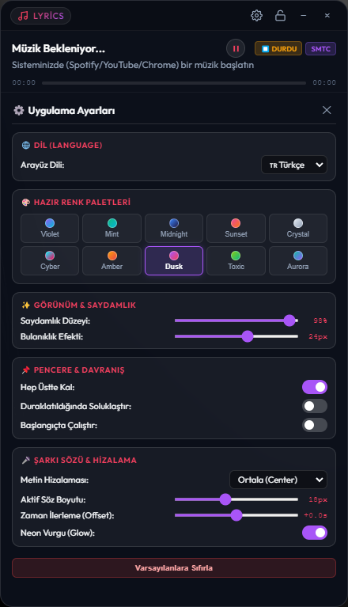

<div align="center">

  

  # 🎵 Desktop Lyrics & Mini-Player Widget

  ### *Ultra-Sleek, Transparent & Real-Time Synchronized Desktop Lyrics for Windows*

  <p align="center">
    <a href="README.md"></a>
    <a href="README_EN.md"></a>
  </p>

  [](https://github.com/phaticusthiccy/Desktop-Lyrics-Widget/releases/)
  [](LICENSE)
  [](https://www.electronjs.org/)
  [](https://nodejs.org/)

  <p align="center">
    <b>Universal Windows Media Player & Web Browser Lyrics Overlay</b><br/>
    Automatically syncs lyrics from <b>Spotify, YouTube, YouTube Music, Apple Music, Chrome, Edge & Brave</b> directly to your desktop.
  </p>

</div>

---

## 📌 Table of Contents

- [🎬 Live Demo \& Showcase](#-live-demo--showcase)
- [✨ Key Features](#-key-features)
- [🎨 10 Dynamic Theme Presets](#-10-dynamic-theme-presets)
- [🎮 Controls \& Global Hotkeys](#-controls--global-hotkeys)
- [🏗️ System Architecture](#️-system-architecture)
- [🚀 Quick Start \& Installation](#-quick-start--installation)
- [📦 Packaging into .EXE](#-packaging-into-exe)
- [📄 License](#-license)

---

## 🎬 Live Demo & Showcase

<div align="center">
  <h3>⚡ Real-Time Synchronization & Media Control in Action</h3>
  
  

  <br/><br/>

  <h3>⚙️ Comprehensive Customization & Settings Panel</h3>
  
</div>

---

## ✨ Key Features

| Feature | Description |
| :--- | :--- |
| **🎧 Universal Media Detection** | Powered by **Windows SMTC** & web player action handlers. Seamlessly supports **Spotify Desktop**, **YouTube**, **YouTube Music**, **Apple Music**, **Chrome**, **Edge**, and **Brave**. |
| **⏯️ Reactive Play/Pause State Machine** | Features a pulse & spin loading state on click, strictly waiting for real background media confirmation before firing a satisfying **POP bounce** transition into its final state. |
| **🎤 High-Precision Karaoke Engine** | Fetches synced timestamped lyrics from the open-source **LRCLIB API** with sub-second interpolation loops (60 FPS). |
| **🔒 Click-Through Lock Mode** | Instantly passes all mouse clicks through the lyrics area (`setIgnoreMouseEvents`) so you can code, game, or browse uninterrupted. Toggle via UI or `Ctrl + Alt + L`. |
| **✨ Glassmorphic Aesthetic** | Real-time GPU backdrop blur (`blur: 0px - 40px`), adjustable glass opacity (%20 - %100), and neon active line glow. |
| **📌 Smart Window Behaviors** | **Always on Top**, **Auto-Dim on Pause** (%50 grayscale fade when music stops), and **Windows Boot Auto-Start** (`setLoginItemSettings`). |
| **⏱️ Sync Offset & Alignment** | Fine-tune audio lag with `-3.0s` ... `+3.0s` live offset controls and align lyrics to **Center**, **Left**, or **Right**. |

---

## 🎨 10 Dynamic Theme Presets

Customize your widget appearance with 10 pre-built HSL gradient themes arranged in a clean 2-row × 5-column grid:

| Theme | Color Swatch | Primary Accent | Glow Effect |
| :--- | :---: | :--- | :--- |
| **Violet** | `🟣 Cyan/Violet` | `#8b5cf6` | `rgba(139, 92, 246, 0.6)` |
| **Mint** | `🟢 Emerald/Cyan` | `#10b981` | `rgba(16, 185, 129, 0.6)` |
| **Midnight** | `🔵 Blue/Indigo` | `#3b82f6` | `rgba(59, 130, 246, 0.6)` |
| **Sunset** | `🟠 Pink/Orange` | `#ec4899` | `rgba(236, 72, 153, 0.6)` |
| **Crystal** | `⚪ White/Sky` | `#e2e8f0` | `rgba(226, 232, 240, 0.5)` |
| **Cyber** | `⚡ Neon Cyan/Magenta` | `#00f3ff` | `rgba(0, 243, 255, 0.7)` |
| **Amber** | `🔥 Gold/Red` | `#f59e0b` | `rgba(245, 158, 11, 0.6)` |
| **Dusk** | `🌆 Lavender/Rose` | `#a855f7` | `rgba(168, 85, 247, 0.6)` |
| **Toxic** | `🧪 Lime/Emerald` | `#84cc16` | `rgba(132, 204, 22, 0.6)` |
| **Aurora** | `🌌 Teal/Sapphire` | `#14b8a6` | `rgba(20, 184, 166, 0.6)` |

---

## 🎮 Controls & Global Hotkeys

| Action | Shortcut / Trigger | Function |
| :--- | :--- | :--- |
| **Toggle Lock Mode** | `Ctrl + Alt + L` | Global system hotkey to enable/disable Click-Through mode. |
| **Settings Panel** | `⚙️ Icon` | Toggles customization panel with a smooth fade view transition. |
| **Play / Pause** | `⏯️ Button` | Toggles media playback with loading indicator & pop bounce. |
| **Drag Window** | `Header Bar` | Left-click and hold the top header bar to position anywhere on screen. |
| **Seek Timeline** | `Progress Bar` | Click anywhere on the scrubber bar to jump to specific seconds. |
| **System Tray** | `Right-Click Tray` | Quick menu for Lock Mode, Always-on-Top, Auto-Start & Exit. |

---

## 🏗️ System Architecture

```
YT-SpotifyWidget/
├── main.js                  # Electron Main Process (Window, Tray, Hotkeys, Auto-Start)
├── preload.js               # Context-isolated secure IPC Bridge
├── package.json             # App metadata, dependencies & Electron-Builder config
├── .gitignore               # Ignored build artifacts & temp files
├── assets/                  # App icons & media assets
│   ├── icon.ico             # Windows app icon
│   ├── icon.svg             # Vector brand logo
│   ├── action.mp4           # Video demonstration
│   └── settings.png         # Settings screenshot
├── services/
│   ├── lrclib.js            # LRCLIB API integration & LRC timestamp parser
│   └── mediaListener.js     # Windows SMTC & ASAR unpacked PowerShell IPC bridge
├── scripts/
│   ├── get-media.ps1        # UTF-8 Windows SMTC session listener
│   └── control-media.ps1    # Media control & Web shortcut dispatch script
└── renderer/
    ├── index.html           # Widget DOM markup
    ├── styles.css           # Glassmorphism, grid themes & keyframe animations
    └── app.js               # 60 FPS interpolation loop & UI event engine
```

---

## 🚀 Quick Start & Installation

### Requirements
- **Node.js** (v18 or higher)
- **Windows 10 / 11**

```bash
# 1. Clone repository
git clone https://github.com/phaticusthiccy/Desktop-Lyrics-Widget.git
cd Desktop-Lyrics-Widget

# 2. Install dependencies
npm install

# 3. Launch in development mode
npm start
```

---

## 📦 Packaging into .EXE

Build ready-to-run Windows executables in one command:

```bash
npm run build
```

Generated outputs will be saved in the **`dist/`** directory:
- **`dist/Desktop Lyrics Widget 1.0.0.exe`** — Single-file Portable standalone executable (no installation required).
- **`dist/Desktop Lyrics Widget Setup 1.0.0.exe`** — NSIS Windows Setup Installer with Start Menu & Desktop shortcuts.

---

## 📄 License

Distributed under the **MIT License**. See [`LICENSE`](LICENSE) for more details.

<div align="center">
  <sub>Created with ❤️ by <a href="https://github.com/phaticusthiccy">Phaticusthiccy</a></sub>
</div>
